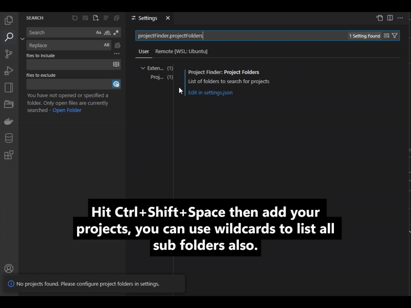

# Project Finder

A Visual Studio Code extension that allows you to quickly find and open your projects using a popup dialog triggered by keyboard shortcuts.

[](https://buymeacoffee.com/doonfrs)



## 🚀 The Missing Project Finder for VS Code

Ever felt frustrated trying to find that project you worked on last week? Tired of navigating through File > Open Folder every time?

**Project Finder** solves the problem VS Code never addressed - quick access to ALL your projects with just a keyboard shortcut!

## ✨ Key Features

- **⌨️ Keyboard-First Approach** - Access any project in milliseconds with Shift+Space
- **🔍 Smart Project Detection** - Automatically identifies real projects with technology-specific icons
- **⭐ Favorites System** - Mark and prioritize your most-used projects
- **🪟 Flexible Window Control** - Open in same window (Enter) or new window (Shift+Enter)
- **🎨 Modern UI** - Windows 11-style grid layout with technology-specific icons
- **🔄 Smart Filtering** - Automatically ignores system folders and build artifacts
- **🌐 Cross-Platform** - Works seamlessly on Windows, macOS, and Linux

## 📸 Screenshots


## 🛠️ Installation

1. Launch VS Code
2. Go to Extensions (Ctrl+Shift+X)
3. Search for "Project Finder"
4. Click Install

## ⚙️ Configuration

Before using Project Finder, you need to configure the folders where your projects are located:

1. Open VS Code Settings (File > Preferences > Settings)
2. Search for "Project Finder"
3. Add your project folders to the "Project Finder: Project Folders" setting

Example configuration:

```json
"projectFinder.projectFolders": [
  "C:\\Users\\YourName\\Projects",
  "D:\\Work\\Repositories",
  "D:\\Work\\Repositories/*"
]
```

For Linux/macOS:

```json
"projectFinder.projectFolders": [
  "/home/username/projects",
  "/var/www/html",
  "/opt/development/*"
]
```

> **Note:** There are two ways to specify project folders:
>
> 1. Regular path (e.g., `/home/username/projects`) - The folder itself will be added as a single project
> 2. Wildcard path (e.g., `/opt/development/*`) - All subfolders will be scanned and added as separate projects
>
> **Windows users:** Git Bash style paths are also supported (e.g., `/c/Users/YourName/Projects`).

## 🎮 Usage

### Custom UI (Default)

1. Press Shift+Space or Ctrl+Shift+Space anywhere in VS Code
2. Use the search box to filter projects
3. Click on a project to select it, or use arrow keys for navigation
4. Press Enter to open in the same window, or Shift+Enter to open in a new window
5. Toggle the "Open in New Window" switch to control window behavior
6. Click the star icon on any project to mark it as a favorite (favorites always appear at the top)

### Native Quick Pick UI

To enable the native VS Code Quick Pick UI:

1. Open VS Code Settings (File > Preferences > Settings)
2. Search for "Project Finder: Use Native UI"
3. Check the box to enable the native UI

Once enabled:

1. Press Shift+Space or Ctrl+Shift+Space anywhere in VS Code
2. Select a project from the dropdown list
3. Press Enter to open in the same window, or Shift+Enter to open in a new window
4. Alternatively, click the split-window button to toggle "New Window Mode"

## 💡 Pro Tips

### Organize Your Projects Like a Pro

- **Development Hub**: Create a central development folder with `/*` wildcard

  ```json
  "projectFinder.projectFolders": ["/home/username/dev/*"]
  ```

- **Mixed Approach**: Combine specific projects with wildcard directories

  ```json
  "projectFinder.projectFolders": [
    "/home/username/dev/*",           // All projects in dev folder
    "/home/username/work/client-x",   // Specific client project
    "/var/www/html/*"                 // All web projects
  ]
  ```

- **Git Bash on Windows**: Use Unix-style paths for consistency across platforms

  ```json
  "projectFinder.projectFolders": [
    "/c/Users/YourName/Projects/*",
    "/d/work/repositories/*"
  ]
  ```

### Keyboard Ninja Workflow

1. Press `Shift+Space` to open Project Finder
2. Type a few characters to filter projects
3. Use arrow keys to navigate
4. Press `Enter` to open in same window
5. Hold `Shift` while pressing `Enter` to open in new window
6. Press `Alt+N` to toggle New Window Mode

## 🧩 How It Works

Project Finder scans the configured folders for valid projects. A folder is considered a valid project if it contains any of the following:

- .git directory
- package.json file
- .vscode directory
- pom.xml file
- build.gradle file
- Cargo.toml file
- go.mod file

The extension supports two ways to specify project folders:

1. Regular paths - The folder itself will be added as a single project
2. Wildcard paths (ending with `/*`) - All subfolders will be scanned and added as separate projects

On Windows, Git Bash style paths (e.g., `/c/Users/YourName/Projects`) are automatically converted to Windows paths (e.g., `C:/Users/YourName/Projects`).

## 🔧 Extension Settings

| Setting | Description |
|---------|-------------|
| `projectFinder.projectFolders` | Array of folder paths to search for projects |
| `projectFinder.enableProjectIndicators` | Enable project indicators to filter directories |
| `projectFinder.projectIndicators` | Files or folders that indicate a valid project |
| `projectFinder.useNativeUI` | Use VS Code's native QuickPick UI instead of the custom UI |
| `projectFinder.ignoredFolders` | List of folders and files to ignore when searching for projects |

## 📋 Release Notes

### 0.0.5

- Added ignored folders configuration to exclude system folders and build artifacts
- Fixed icon display issues with proper font loading
- Fixed duplicate popup issue when pressing the shortcut multiple times
- Added support for technology-specific icons using Devicon
- Improved UI with better icon display and layout
- Enhanced documentation with clearer feature overview

### 0.0.4

- Added Windows 11-style UI with grid layout and project icons
- Added automatic project technology detection
- Added favorites feature to mark and prioritize frequently used projects
- Improved Shift+Enter functionality to open projects in a new window
- Made the custom UI the default experience
- Renamed setting from `useCustomUI` to `useNativeUI` (inverted logic)
- Added automatic selection of the first project in filtered results
- Enhanced keyboard navigation with arrow keys

### 0.0.3

- Added custom popup dialog UI option with enhanced features:
  - Modern, VS Code-themed interface
  - Improved search functionality with result count
  - Double-click to open projects
  - Keyboard navigation support
  - Checkbox for new window toggle
  - Configuration option to choose between QuickPick and custom UI
  - Uses the same keyboard shortcuts for both UI options

### 0.0.2

- Added support for wildcard paths (e.g., `/home/username/projects/*`)
- Added support for Git Bash style paths on Windows
- Added Shift+Enter functionality to open projects in a new window
- Added Ctrl+Shift+Space as an alternative keyboard shortcut
- Updated minimum VS Code version to 1.75.0 for improved extension activation

### 0.0.1

Initial release of Project Finder

## ⚡ Why Project Finder?

| Feature | Project Finder | VS Code Built-in | Other Extensions |
|---------|---------------|------------------|------------------|
| Keyboard-first approach | ✅ | ❌ | ⚠️ Limited |
| Smart project detection | ✅ | ❌ | ⚠️ Some |
| Technology-specific icons | ✅ | ❌ | ❌ |
| Favorites system | ✅ | ❌ | ❌ |
| Wildcard folder support | ✅ | ❌ | ❌ |
| Git Bash path support | ✅ | ❌ | ❌ |
| New window toggle | ✅ | ⚠️ Requires extra steps | ⚠️ Limited |
| Shift+Enter shortcut | ✅ | ❌ | ❌ |
| System folder filtering | ✅ | ❌ | ❌ |
| Lightweight | ✅ | ✅ | ⚠️ Varies |

Project Finder was built by developers who were tired of the friction in the standard VS Code workflow. We wanted something that felt like it should have been built into VS Code from the beginning.

## 👥 Community & Contributions

Project Finder is an open-source project that thrives on community feedback and contributions!

### Ways to Contribute

- **Star the Repository**: Show your support and help others discover the extension
- **Report Issues**: Found a bug? Let us know on the GitHub issues page
- **Suggest Features**: Have ideas for improvements? We'd love to hear them
- **Submit Pull Requests**: Code contributions are always welcome
- **Share with Friends**: Help spread the word about Project Finder

Join our growing community of developers who value efficiency and productivity in their VS Code workflow!

## ☕ Support

If you find this extension helpful, consider buying me a coffee:

[](https://buymeacoffee.com/doonfrs)

## 🧑‍💻 For Development

### Building the Extension

1. Clone the repository
2. Run `npm install` to install dependencies
3. Run `npm run watch` to compile in watch mode
4. Press F5 to launch the extension in debug mode

### Technical Notes

- The extension uses the modern `onStartupFinished` activation event, which is more efficient than the older command-based activation events
- VS Code 1.75.0+ automatically generates activation events based on contribution points, but the `vsce` packaging tool may still require an explicit `activationEvents` property
- The extension offers two UI options:
  - Quick Pick UI: Uses VS Code's native QuickPick API
  - Custom Popup Dialog: Uses WebView Panel with popup styling for a fully customizable interface
- The WebView HTML content is stored in a separate file for easier maintenance and customization

### Publishing

Follow the [VS Code Extension Publishing](https://code.visualstudio.com/api/working-with-extensions/publishing-extension) guide.

Your support helps maintain and improve this extension!
